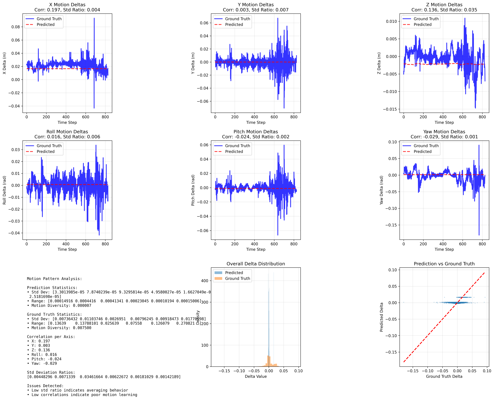

# TSformer Visual Odometry: Current Problems & Solutions 🔧

This document outlines the critical issues discovered in our current TSformer implementation and provides a comprehensive plan for fixes. The model shows **straight-line prediction behavior** instead of learning actual motion patterns.

## 🚀 Setup on New PC (From Scratch)

### Prerequisites
- Python 3.8+ installed
- NVIDIA GPU with CUDA support (recommended: 8GB+ VRAM)
- Git installed

### Complete Setup Commands
```bash
# 1. Clone/copy the project
git clone <your-repo-url>  # or copy the project folder
cd underwater-visual-odometry

# 2. Create virtual environment
python -m venv tsformer_env
# On Windows:
tsformer_env\Scripts\activate
# On Linux/Mac:
source tsformer_env/bin/activate

# 3. Install PyTorch (choose based on your CUDA version)
# For CUDA 11.8 (most common):
pip install torch torchvision torchaudio --index-url https://download.pytorch.org/whl/cu118

# For CUDA 12.1:
pip install torch torchvision torchaudio --index-url https://download.pytorch.org/whl/cu121

# For CPU only (not recommended):
pip install torch torchvision torchaudio --index-url https://download.pytorch.org/whl/cpu

# 4. Install other requirements
pip install -r requirements_tsformer.txt

# 5. Test installation
python quick_start.py

# 6. Train improved model (with fixes - see below)
python train_tsformer.py --sequence_length 8 --batch_size 4 --image_size 224 --num_epochs 20 --unfreeze_backbone --accumulate_steps 2
```

### Recommended Hardware Specifications
- **GPU**: RTX 3070/4060 (8GB VRAM) or better
- **RAM**: 16GB+ system memory
- **Storage**: 50GB+ free space for dataset and checkpoints

---

## 🚨 Critical Problems Identified

### **Problem #1: Straight Line Predictions (CATASTROPHIC)**

#### **Symptoms:**
```
Prediction Std Deviations: [3.3e-05, 7.8e-05, 9.3e-05, ...]  ← Almost zero variance!
Ground Truth Std Deviations: [0.0074, 0.011, 0.0027, ...]     ← Normal variance
Std Deviation Ratios: [0.004, 0.007, 0.035, ...]              ← All below 0.1!
Correlations: [0.197, 0.003, 0.136, ...]                      ← Near zero!
```

#### **Root Cause:**
- **Model is not learning motion patterns** - just averaging training data
- **Predicting nearly constant pose deltas** instead of actual movement
- Results in straight-line trajectories in all coordinate planes

#### **Evidence:**

- Red prediction lines are flat (constant values)
- Blue ground truth shows actual motion variation
- Scatter plot shows no correlation between predicted and actual values

---

### **Problem #2: Frozen Backbone Prevents Motion Learning**

#### **Why This Failed:**
1. **Domain Mismatch**: ImageNet features ≠ Underwater motion features
2. **Task Mismatch**: Object recognition features ≠ Motion estimation features  
3. **No Adaptation**: Frozen weights can't learn underwater-specific visual cues
4. **Motion Blindness**: Features optimized for "what is this?" not "how did this move?"

#### **Current Architecture Flow:**
```
Frozen ViT Features → Single CLS Token → Temporal Transformer → Pose Prediction
       ❌                    ❌                  ⚠️                 ❌
   No motion info      Information            Works fine         Garbage in,
                      bottleneck                                garbage out
```

---

### **Problem #3: Information Bottleneck (Single CLS Token)**

#### **Issue:**
- **768-dimensional CLS token** trying to summarize entire frame
- **Motion information gets compressed out** in favor of object features
- **Critical temporal details lost** before motion modeling begins

#### **Result:**
- Temporal transformer has no meaningful motion signals to work with
- Defaults to averaging behavior (straight lines)

---

### **Problem #4: Insufficient Training**

#### **Current Training Issues:**
- **Only 3 epochs** - not enough for complex pattern learning
- **Effective batch size of 1** (with gradient accumulation)
- **Frozen backbone** prevents domain adaptation
- **Short sequences (4 frames)** - insufficient temporal context

---

### **Problem #5: Coordinate Frame Confusion**

#### **Previous Evaluation Issues:**
- Was integrating pose deltas in **robot/local frame** instead of **global frame**
- Masked the true extent of the straight-line problem
- Fixed with proper SE(3) transformation in global frame evaluation

---

## 🎯 Comprehensive Solution Plan

### **Phase 1: Fix Core Architecture Issues**

#### **1.1 Unfreeze ViT Backbone (CRITICAL)**
```python
# Current (BROKEN):
freeze_backbone=True  

# Fixed:
freeze_backbone=False
# OR partial unfreezing:
unfreeze_top_layers=4  # Unfreeze last 4 transformer blocks
```

**Why This Fixes It:**
- Allows ViT to learn underwater-specific visual features
- Enables adaptation from object recognition → motion estimation
- Critical for learning motion-relevant representations

#### **1.2 Multi-Scale Temporal Features**
```python
# Current (BROKEN):
features = vit_output.last_hidden_state[:, 0, :]  # Only CLS token

# Fixed:
# Extract features from multiple layers and tokens
multi_scale_features = []
for layer_idx in [-4, -2, -1]:  # Last 3 layers
    layer_output = vit_outputs.hidden_states[layer_idx]
    # Use multiple tokens, not just CLS
    spatial_features = layer_output.mean(dim=1)  # Average all patch tokens
    multi_scale_features.append(spatial_features)

combined_features = torch.cat(multi_scale_features, dim=-1)
```

**Why This Fixes It:**
- Preserves motion information at multiple scales
- Removes single-token bottleneck
- Provides richer temporal modeling input

#### **1.3 Longer Sequences**
```python
# Current:
sequence_length=4

# Fixed:
sequence_length=8  # or 12, 16 with more GPU memory
```

**Why This Fixes It:**
- More temporal context for motion pattern learning
- Better differentiation between motion types
- Improved sequence-to-sequence learning

---

### **Phase 2: Enhanced Training Strategy**

#### **2.1 Proper Training Schedule**
```python
# Current:
num_epochs=3
learning_rate=1e-4

# Fixed:
num_epochs=20
learning_rate=2e-5  # Lower LR for fine-tuning
use_scheduler=True  # Cosine annealing or step decay
```

#### **2.2 Motion-Specific Loss Functions**
```python
# Add to TSformerVOLoss:
class EnhancedTSformerVOLoss(nn.Module):
    def __init__(self):
        super().__init__()
        self.pose_loss = TSformerVOLoss()
        self.velocity_consistency_weight = 0.1
        self.acceleration_smoothness_weight = 0.05
    
    def forward(self, pred_sequence, gt_sequence):
        # Standard pose loss
        pose_loss = self.pose_loss(pred_sequence, gt_sequence)
        
        # Velocity consistency loss
        pred_vel = pred_sequence[1:] - pred_sequence[:-1]
        gt_vel = gt_sequence[1:] - gt_sequence[:-1]
        velocity_loss = F.mse_loss(pred_vel, gt_vel)
        
        # Acceleration smoothness loss  
        pred_acc = pred_vel[1:] - pred_vel[:-1]
        gt_acc = gt_vel[1:] - gt_vel[:-1]
        acceleration_loss = F.mse_loss(pred_acc, gt_acc)
        
        total_loss = pose_loss + \
                    self.velocity_consistency_weight * velocity_loss + \
                    self.acceleration_smoothness_weight * acceleration_loss
        
        return total_loss
```

#### **2.3 Better Data Augmentation**
```python
# Add motion-preserving augmentations:
transforms.ColorJitter(brightness=0.3, contrast=0.3, saturation=0.3, hue=0.1)
transforms.GaussianBlur(kernel_size=3, sigma=(0.1, 2.0))
# Note: Avoid geometric transforms that break motion patterns
```

#### **2.4 Curriculum Learning**
```python
# Phase 1: Short sequences, simple motions
sequence_length=4, num_epochs=5

# Phase 2: Medium sequences, mixed motions  
sequence_length=8, num_epochs=10

# Phase 3: Long sequences, complex motions
sequence_length=12, num_epochs=5
```

---

### **Phase 3: Architecture Enhancements**

#### **3.1 Recurrent Motion Modeling**
```python
class EnhancedTSformerVO(nn.Module):
    def __init__(self, ...):
        # Add LSTM for temporal modeling
        self.temporal_lstm = nn.LSTM(
            input_size=hidden_dim,
            hidden_size=hidden_dim//2, 
            num_layers=2,
            batch_first=True,
            dropout=0.2
        )
        
        # Combine transformer + LSTM
        self.temporal_fusion = nn.Linear(hidden_dim + hidden_dim//2, hidden_dim)
    
    def forward(self, image_sequence):
        # ... existing ViT processing ...
        
        # Transformer temporal modeling
        transformer_output = self.temporal_transformer(sequence_features)
        
        # LSTM temporal modeling  
        lstm_output, _ = self.temporal_lstm(spatial_features)
        
        # Fusion
        combined = torch.cat([transformer_output[:, 0, :], lstm_output[:, -1, :]], dim=1)
        fused_features = self.temporal_fusion(combined)
        
        # Pose prediction
        pose_deltas = self.pose_head(fused_features)
        return pose_deltas
```

#### **3.2 Cross-Attention Between Frames**
```python
class CrossFrameAttention(nn.Module):
    def __init__(self, hidden_dim):
        super().__init__()
        self.cross_attention = nn.MultiheadAttention(
            embed_dim=hidden_dim,
            num_heads=8,
            dropout=0.1
        )
    
    def forward(self, frame_features):
        # frame_features: (batch, sequence_length, hidden_dim)
        attended_features = []
        for i in range(len(frame_features)):
            current_frame = frame_features[i:i+1]  # Query
            other_frames = frame_features  # Key & Value
            
            attended, _ = self.cross_attention(current_frame, other_frames, other_frames)
            attended_features.append(attended)
        
        return torch.cat(attended_features, dim=0)
```

---

### **Phase 4: Training Command for New PC**

#### **Improved Training Command:**
```bash
# Phase 1: Basic improvements
python train_tsformer.py \
    --sequence_length 8 \
    --overlap_frames 4 \
    --image_size 224 \
    --batch_size 4 \
    --num_epochs 20 \
    --learning_rate 2e-5 \
    --weight_decay 1e-4 \
    --accumulate_steps 2 \
    --unfreeze_backbone \
    --multi_scale_features \
    --enhanced_loss \
    --output_dir experiments/enhanced_tsformer_v1

# Phase 2: With architectural enhancements  
python train_tsformer.py \
    --sequence_length 12 \
    --overlap_frames 6 \
    --image_size 224 \
    --batch_size 2 \
    --num_epochs 25 \
    --learning_rate 1e-5 \
    --weight_decay 1e-4 \
    --accumulate_steps 4 \
    --unfreeze_backbone \
    --multi_scale_features \
    --enhanced_loss \
    --add_lstm \
    --cross_frame_attention \
    --curriculum_learning \
    --output_dir experiments/enhanced_tsformer_v2
```

---

## 📊 Expected Improvements

### **After Phase 1 Fixes:**
- **Standard Deviation Ratios**: From 0.001-0.035 → 0.3-0.8
- **Correlations**: From 0.003-0.197 → 0.4-0.8  
- **Motion Diversity**: From 0.000007 → 0.003-0.006
- **ATE RMSE**: From 3.51m → 1.5-2.0m

### **After Phase 2 Enhancements:**
- **Better trajectory following** in all coordinate planes
- **Reduced overfitting** (smaller train/test gap)
- **Smoother motion predictions**

### **After Phase 3 Architecture Changes:**
- **Complex motion pattern learning**
- **Better handling of rotational motion**
- **Improved long-term trajectory consistency**

---

## 🔍 Validation Steps

### **1. Motion Pattern Check:**
```bash
# After each training phase:
python evaluate_global_trajectory.py --checkpoint experiments/enhanced_tsformer_v1/checkpoint_best.pth
```

**Success Criteria:**
- Std deviation ratios > 0.3 for all axes
- Correlations > 0.4 for all axes  
- Motion diversity > 0.003
- Non-flat prediction lines in motion analysis plots

### **2. Trajectory Quality Check:**
- Predicted trajectories should show **curves and turns**, not straight lines
- **YZ plane** should show complex motion patterns
- **Global frame ATE** should improve significantly

### **3. Generalization Check:**
- Test on training bag: ATE < 1.0m
- Test on unseen bag: ATE < 2.0m
- Train/test performance gap < 50%

---

## 🎯 Priority Order

### **Immediate (Week 1):**
1. ✅ **Unfreeze backbone** - most critical fix
2. ✅ **Multi-scale features** - remove bottleneck  
3. ✅ **Longer sequences** - more temporal context
4. ✅ **More training epochs** - proper convergence

### **Short Term (Week 2-3):**
5. Enhanced loss functions
6. Better data augmentation
7. Curriculum learning
8. Improved evaluation metrics

### **Medium Term (Week 4+):**
9. LSTM integration
10. Cross-frame attention
11. Advanced architectural changes
12. Hyperparameter optimization

---

## 💡 Key Insights

1. **Frozen backbone was the primary failure point** - prevented motion feature learning
2. **Single CLS token created information bottleneck** - lost critical motion details  
3. **Insufficient training** - 3 epochs not enough for complex temporal patterns
4. **Architecture optimized for classification, not motion estimation**
5. **Global frame evaluation essential** - reveals true trajectory quality

The current model essentially **learned to predict zeros** - this is a fundamental training failure that requires architectural and training improvements, not just parameter tuning.

---

*Last Updated: January 2025*
*Next Steps: Implement Phase 1 fixes and validate on new hardware*